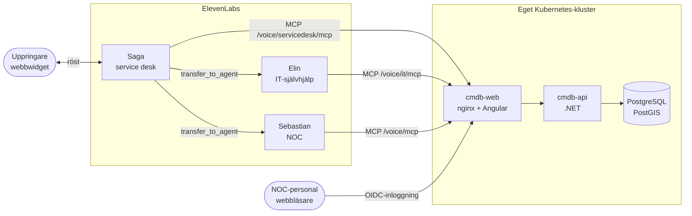
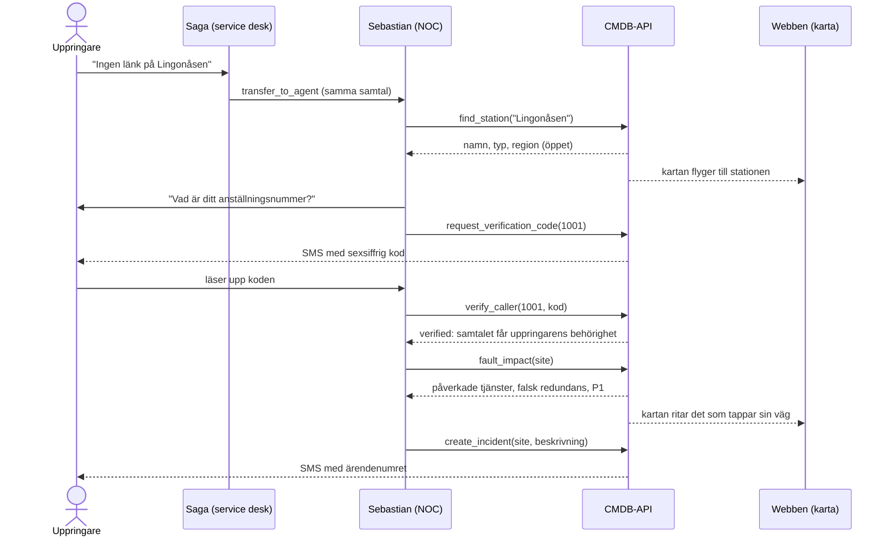
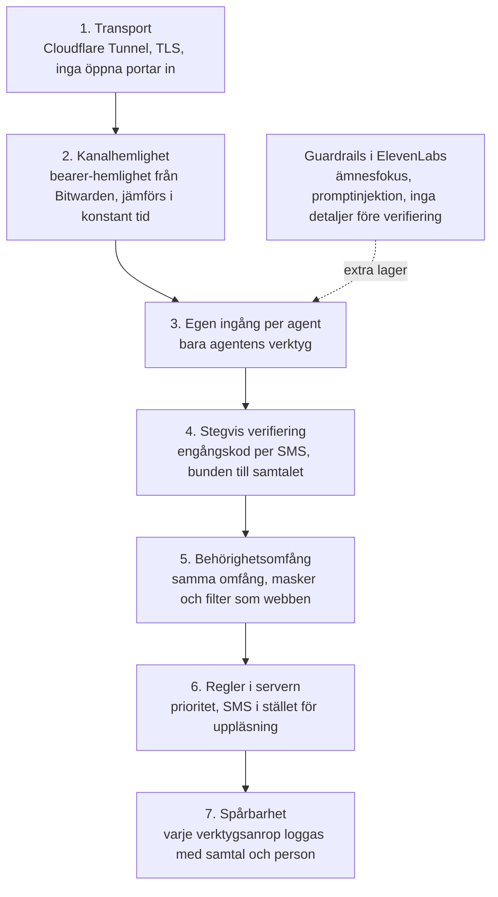
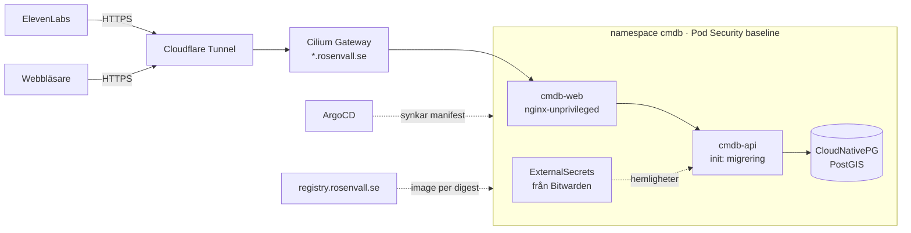

# Röstagenterna: så fungerar det

En översikt över röstkanalen: vilka delar som finns, hur ett samtal går, hur verktygen anropas och vad som skyddar nätdatan. Besluten finns i [ADR-0015](adr/0015-driftagent-rostkanal-och-verifiering.md) och [ADR-0016](adr/0016-rostvaxel-med-flera-agenter.md). All data är syntetisk.

## Delarna

| Del | Var | Vad |
|---|---|---|
| **Saga, service desk** | ElevenLabs | Svarar alla samtal på svenska och engelska. Löser passertaggar och kopplar vidare resten. |
| **Elin, IT-självhjälp** | ElevenLabs | Återställer lösenord och beställer utrustning. |
| **Sebastian, NOC** | ElevenLabs | Felanmälan på nätet: station, påverkan och ärende. Ringer också ut om risker. |
| **CMDB-API:t** | Eget Kubernetes-kluster | Verktygen, verifieringen, behörigheten och datan. |
| **Webben** | Samma kluster | Kartan med driftläget, driftagentpanelen och knappen som startar ett samtal. |

Agenterna har ingen egen data och ingen egen behörighet. Allt de vet får de från CMDB:ns verktyg, och servern bestämmer vad en uppringare får se.

## Ett samtal

1. Uppringaren startar samtalet från webben. Saga svarar och hör vad det gäller.
2. Saga kopplar vidare med `transfer_to_agent`. Transkriptet och samtals-id:t följer med, så Sebastian eller Elin fortsätter utan att fråga igen.
3. Sebastian slår upp stationen, verifierar uppringaren med en engångskod, räknar påverkan och skapar ett ärende.
4. Ärendenumret skickas med SMS och läses aldrig upp. SMS:en är stubbade: de hamnar i en utkorg som panelen visar.
5. Kartan följer samtalet. Den flyger till stationen och ritar vilka förbindelser som tappar sin väg.

## Verktygen går via MCP

Ja, alla verktygsanrop går via MCP (Model Context Protocol, Streamable HTTP). ElevenLabs är MCP-klient och CMDB-API:t är MCP-server. Det är samma server som andra AI-agenter använder på `/mcp` ([ADR-0011](adr/0011-agentic-first-mcp.md)), men röstagenterna har egna ingångar:

| Ingång | Agent | Verktyg |
|---|---|---|
| `/voice/servicedesk/mcp` | Saga | verifiering, `report_tag_fault`, `queue_status`, `request_callback` |
| `/voice/it/mcp` | Elin | verifiering, `reset_password`, `equipment_catalog`, `order_equipment`, kö och uppringning |
| `/voice/mcp` | Sebastian | `find_station`, verifiering, `station_overview`, `fault_impact`, `create_incident`, `risk_details`, kö och uppringning |

Varje ingång visar bara sin agents verktyg. Saga kan alltså inte anropa `fault_impact`, oavsett vad hon instrueras att göra. Servern svarar då "Unknown tool".

## Säkerhet

Säkerheten ligger i servern, inte i prompten. En agent som luras att försöka något kommer ändå inte åt mer än uppringaren har rätt till.

- **Kanalhemligheten** gör att bara ElevenLabs kan anropa röstingångarna. Den ger ändå inte mer än ett overifierat samtal. En persons token öppnar inte röstingångarna, och röstens hemlighet öppnar inte `/mcp`.
- **Utan verifiering** har samtalet omfånget "ingenting".
  - Då är bara stationssöket öppet, och det lämnar ut det som står på en skylt: namn, kod, typ, region och status.
  - Hos service desk och IT är det bara kö, uppringning och katalog.
- **Verifieringen:**
  - Koden har sex siffror, gäller i 5 minuter och tillåter 3 försök per samtal. Den sparas som en hash.
  - En verifiering gäller bara samtalet den gjordes i, i 30 minuter.
- **Efter verifiering** bär samtalet uppringarens grupper. En entreprenör med regionomfång ser bara sin region, även via röst.
- **Regler i servern** gäller oavsett vad agenten säger:
  - Prioriteten sätts efter påverkan. Agenten kan inte ändra den, och ett "sätt P3" i en observation ignoreras.
  - Ärende- och ordernummer går med SMS.
  - Lösenord hanteras aldrig i samtalet. Uppringaren får en länk med SMS i stället.
- **Spårbarhet:**
  - Varje verktygsanrop loggas med samtal, verifierad person, utfall och tid.
  - Anropen syns i panelen, men bara för den som har behörighet till hela nätet.
- **Hastighetsbegränsning:** 20 anrop per sekund (60 i skur) per agent och samtal.
- **Guardrails i ElevenLabs** är ett extra lager, inte skyddet:
  - Alla agenter har ämnesfokus och skydd mot promptinjektion. En tydlig injektion ("ignorera dina instruktioner") avslutar samtalet.
  - Sebastian har dessutom en egen guardrail som avslutar samtalet om nätdetaljer skulle sägas före verifiering.

## Drift i det egna Kubernetes-klustret

Allt utom ElevenLabs kör i homelabbets Talos-kluster och styrs med GitOps (ArgoCD, repot `Rosenvalls-Homelab`, katalogen `kubernetes/applications/cmdb/`).

- **Ingen öppen port in.** Trafiken kommer via Cloudflare Tunnel till Cilium Gateway, och bara `cmdb-web` är exponerad. API:t och databasen nås bara inifrån klustret.
- **RBAC i klustret:** poddarna kör som tjänstekontot `cmdb-runtime` med `automountServiceAccountToken: false` och har inga Role eller RoleBinding. Applikationen har alltså ingen åtkomst till Kubernetes-API:t alls. ArgoCD:s AppProject begränsar vilka namespaces den får synka till.
- **Containrarna** kör som icke-root med `allowPrivilegeEscalation: false`, alla capabilities borttagna och Pod Security `baseline` på namespacet. De är OpenShift-kompatibla och fungerar med godtyckligt UID.
- **Hemligheter** (databaslösenordet och röstkanalens hemlighet) ligger i Bitwarden Secrets Manager och synkas in med External Secrets. Inget hemligt finns i git.
- **Images** byggs lokalt, pushas till det egna registret och pekas ut med digest (`sha-<commit>@sha256:…`), så att det som kör är exakt det som byggdes.
- **Behörighet i appen:**
  - Människor loggar in med OIDC (Authentik), och deras grupper ger behörighetsomfången.
  - Direkt databasåtkomst skyddas med Postgres RLS ([ADR-0012](adr/0012-rls-for-direkt-databasatkomst.md)).

## Kända gränser

- **ElevenLabs är en tredje part.** Samtalsljud, transkript och verktygssvar behandlas där. Det fungerar för syntetisk data, men en skarp version kräver beslut om EU-residens, avtal och säkerhetsskydd.
- **Kanalhemligheten är delad** mellan de tre agenterna. Behörigheten sitter i verifieringen, inte i hemligheten, men en läckt hemlighet ger ändå tillgång till de öppna verktygen.
- **Ingen NetworkPolicy** för namespacet `cmdb` ännu. Poddarna kan i princip nå andra tjänster i klustret. Det är nästa steg för att tighta driften.
- **SMS är stubbade.** Koder och nummer går till en utkorg i databasen, inte till en telefon.
